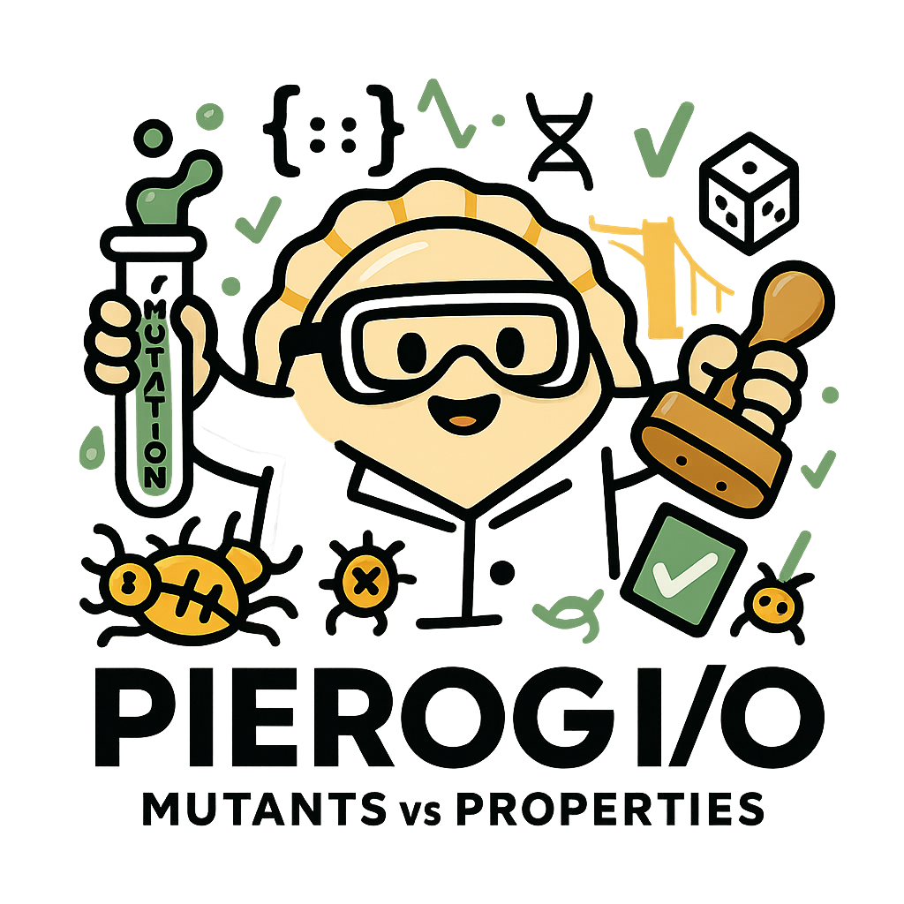

# PierogI/O

*Pittsburgh's first AI-powered, blockchain-enabled, synergistic pierogi delivery platform. We're disrupting the Eastern European dumpling space with our revolutionary farm-to-mouth logistics pipeline.*



Series A funding: $47M | Valued at: $2B | Profitable: Ask again later

**Our Mission**: Bringing artisanal potato-filled dough pockets to your doorstep at venture-capital-subsidized prices. Because Pittsburgh deserves better than boring old restaurants that actually make money.


## 🏗️ Domain Model

### Entities

- **Order**: `{ id, items: [OrderItem], delivery, customer, coupon }`
- **OrderItem**: `{ sku, title, kind: 'hot'|'frozen', filling, qty, unitPriceCents, addOns }`
- **Delivery**: `{ distanceKm, zone: 'local'|'outer', rush: boolean }`
- **Profile**: `{ tier: 'guest'|'regular'|'vip' }`

### Menu

- **P6-POTATO**: 6-pack, $6.99
- **P12-POTATO**: 12-pack, $12.99 (volume pricing eligible)
- **P24-POTATO**: 24-pack, $23.99 (party size)
- **P6-SAUER**: 6-pack Sauerkraut, $7.49
- **Add-ons**: sour-cream ($0.99), fried-onion ($1.49), bacon-bits ($1.99)

### Coupons

- **PIEROGI-BOGO**: Buy one 6-pack, get one 50% off (same filling)
- **FIRST10**: 10% off orders ≥ $20

## 📐 Business Rules

1. **Subtotal**: Base prices + add-ons
2. **Discounts**: Volume pricing (5% @ 12-pack, 10% @ 24-pack) + coupons
3. **Delivery**: Base fee by zone, waived if discounted subtotal ≥ threshold, +$2.99 rush fee
4. **Tax**: 8% on hot items only (frozen exempt), delivery taxable if any hot items
5. **Total**: Subtotal - Discounts + Delivery + Tax

### Free Delivery Thresholds
- **Guest**: ≥ $50
- **Regular**: ≥ $40
- **VIP**: ≥ $30

## 🧪 Testing

### Installation

```bash
npm install
```

### Running Tests

```bash
# All tests
npm test

# Unit tests only
npm run test:unit

# Property-based tests only
npm run test:properties
```
